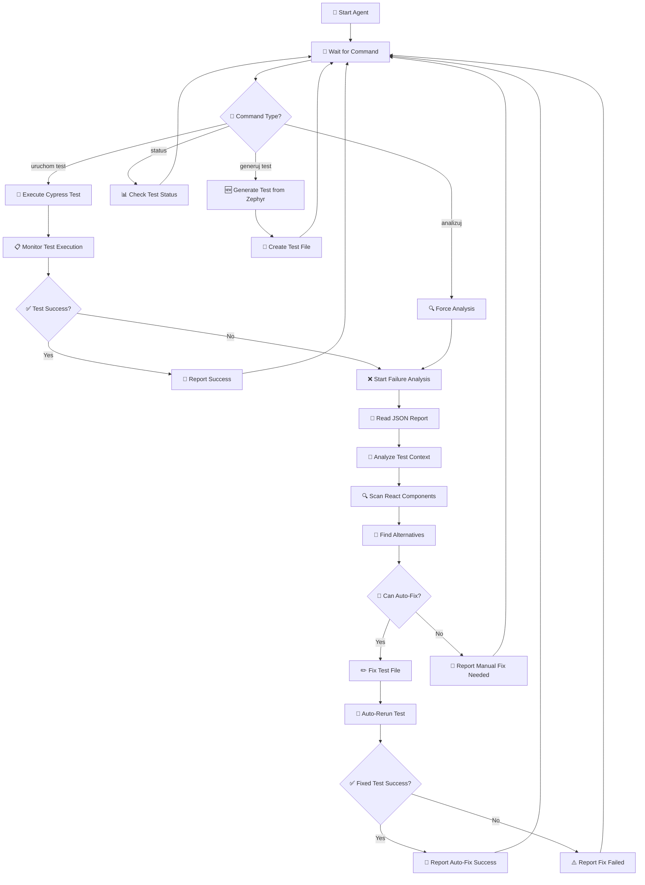
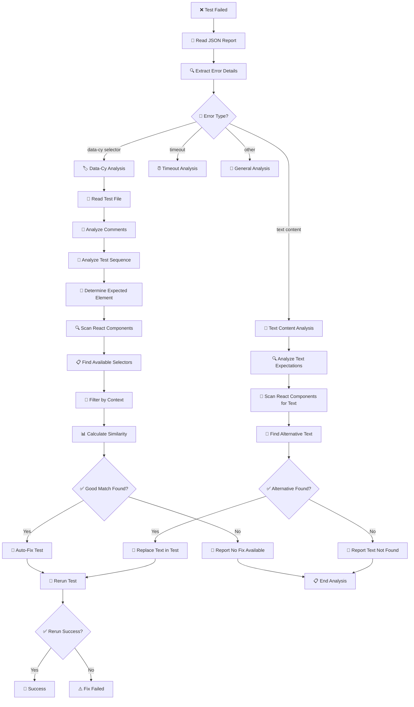
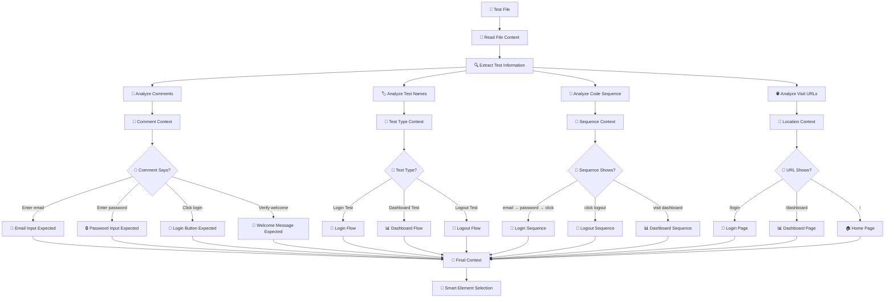
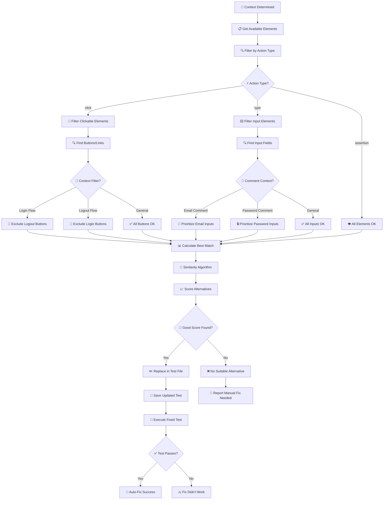
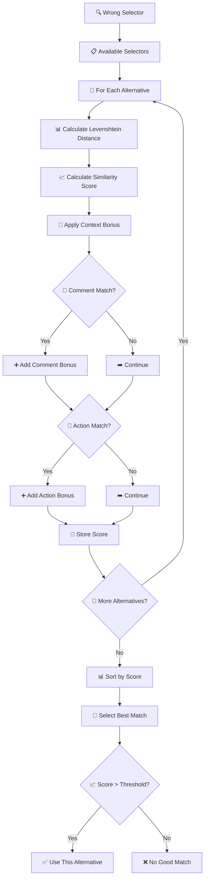
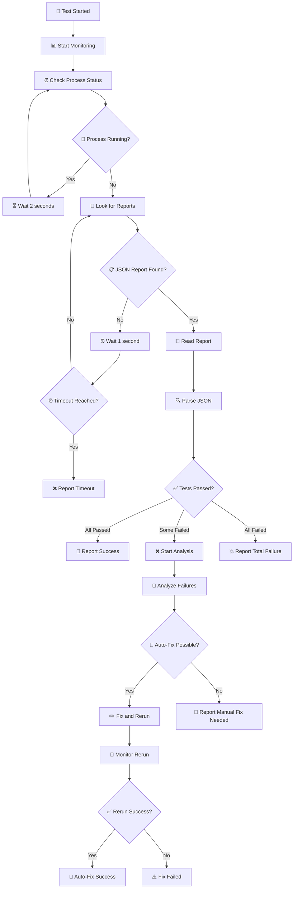
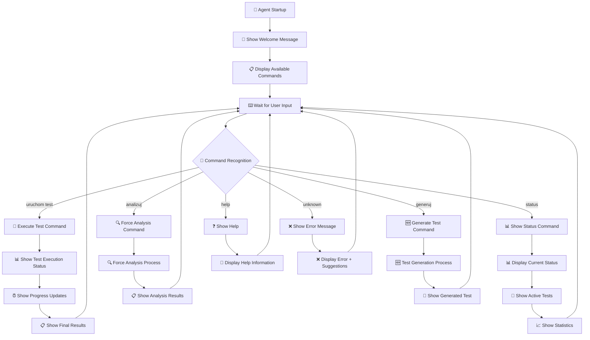

# 🧠 Schematy Logiczne Działania Agenta AI

## 📊 Główny Workflow Agenta



## 🔍 Schemat Analizy Błędów Testów



## 🎯 Schemat Analizy Kontekstu Testu



## 🔧 Schemat Auto-Fix Procesu



## 🆕 Schemat Generowania Testów z Zephyr

```mermaid
graph TD
    A[📋 Zephyr Test Case] --> B[📖 Parse Test Case]
    B --> C[🔍 Extract Test Steps]
    C --> D[🎯 Analyze Step Types]
    
    D --> E{📝 Step Type?}
    E -->|Navigate| F[🌐 Generate cy.visit()]
    E -->|Enter Data| G[⌨️ Generate cy.type()]
    E -->|Click Element| H[🔘 Generate cy.click()]
    E -->|Verify| I[✅ Generate cy.should()]
    
    F --> J[🔍 Determine URL]
    J --> K[📝 Add Navigation Comment]
    K --> L[💾 Store Step]
    
    G --> M[🔍 Determine Input Type]
    M --> N{📧 Input Type?}
    N -->|Email| O[🏷️ Use email-input selector]
    N -->|Password| P[🏷️ Use password-input selector]
    N -->|Other| Q[🏷️ Generate appropriate selector]
    
    O --> R[💬 Add Input Comment]
    P --> R
    Q --> R
    R --> L
    
    H --> S[🔍 Determine Button Type]
    S --> T{🔘 Button Type?}
    T -->|Login| U[🏷️ Use login-button selector]
    T -->|Submit| V[🏷️ Use submit-button selector]
    T -->|Other| W[🏷️ Generate appropriate selector]
    
    U --> X[💬 Add Click Comment]
    V --> X
    W --> X
    X --> L
    
    I --> Y[🔍 Determine Verification Type]
    Y --> Z{👁️ Verify Type?}
    Z -->|URL| AA[🌐 Generate cy.url().should()]
    Z -->|Element Visible| BB[👁️ Generate cy.should('be.visible')]
    Z -->|Text Content| CC[📝 Generate cy.contains().should()]
    
    AA --> DD[💬 Add Verification Comment]
    BB --> DD
    CC --> DD
    DD --> L
    
    L --> EE{🔄 More Steps?}
    EE -->|Yes| E
    EE -->|No| FF[📄 Generate Test File]
    
    FF --> GG[📝 Create describe() block]
    GG --> HH[📝 Create it() block]
    HH --> II[📝 Add beforeEach() if needed]
    II --> JJ[📝 Combine all steps]
    JJ --> KK[💾 Save Test File]
    KK --> LL[🎉 Test Generated Successfully]
```

## 🧮 Schemat Algorytmu Podobieństwa



## 🔄 Schemat Monitorowania Testów



## 📱 Schemat Interfejsu Użytkownika



---

## 📊 Legenda Symboli

- 🚀 **Start/Execute** - Rozpoczęcie procesu
- 🔍 **Analyze** - Analiza danych
- 📖 **Read** - Odczyt plików/danych
- 💬 **Comment** - Analiza komentarzy
- 🎯 **Context** - Określenie kontekstu
- 🔧 **Fix** - Naprawianie błędów
- ✅ **Success** - Sukces operacji
- ❌ **Error** - Błąd/niepowodzenie
- 📊 **Status** - Status/statystyki
- 🆕 **Generate** - Generowanie nowego
- 🔄 **Loop** - Pętla/powtarzanie
- 💾 **Save** - Zapisywanie
- 🎉 **Complete** - Zakończenie sukcesu

**🧠 Schematy pokazują pełną logikę działania inteligentnego agenta AI!** 🤖✨
